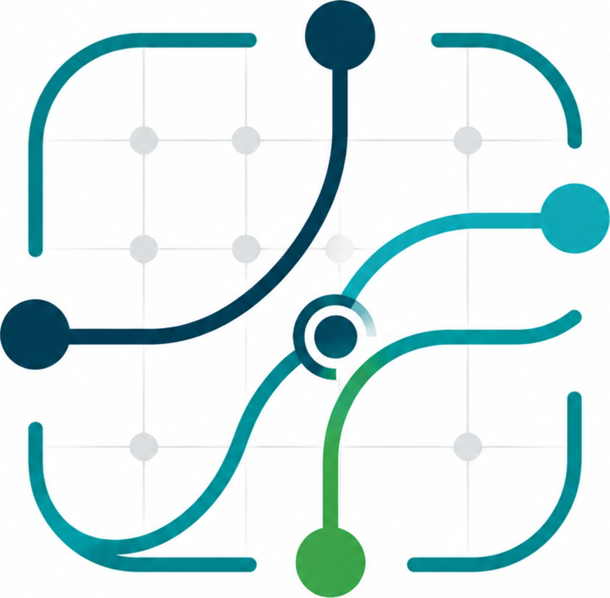
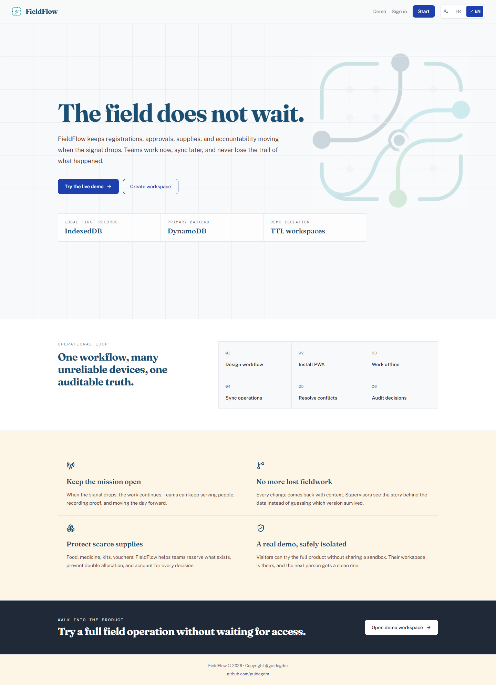
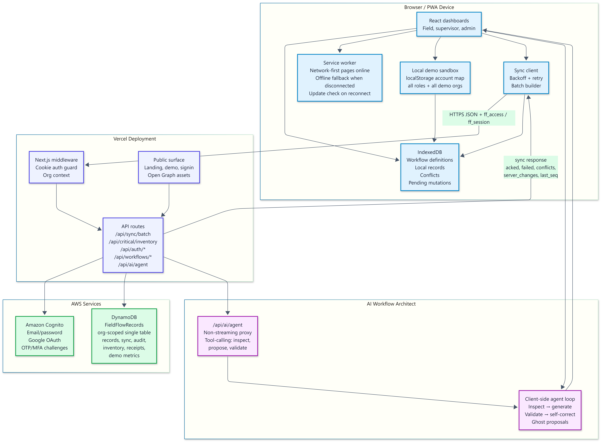
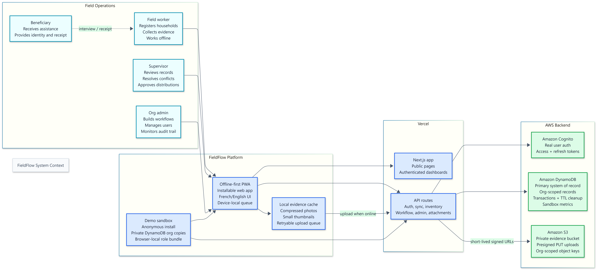

<p align="center">
  
</p>

<h1 align="center">FieldFlow</h1>

<p align="center">
  Offline-first field operations for teams that cannot stop when the network disappears.
</p>

<p align="center">
  <a href="https://fieldflow-tau.vercel.app">Live app</a>
  ·
  <a href="./video-script.md">Demo script</a>
</p>

<p align="center">
  
  
  
  
</p>

<p align="center">
  
</p>

This live desktop view shows the core promise: field teams can design workflows, install the PWA, keep working offline, synchronize operations, resolve conflicts, and preserve an auditable trail. The landing page also calls out the actual product foundation: IndexedDB on the device, DynamoDB as the primary backend, and TTL-scoped demo workspaces.

## What FieldFlow Solves

FieldFlow is built for field teams working in limited-connectivity environments: humanitarian response, rural health, logistics, agriculture, construction, and community programs. These teams still need to register people, collect evidence, review cases, reserve inventory, and preserve an audit trail when internet access is unstable or unavailable.

FieldFlow turns operational workflows into installable Progressive Web Apps. Workers save records locally in IndexedDB, keep moving offline, and synchronize through a DynamoDB-backed operation log when connectivity returns.

## Current Product

- Offline-first PWA shell with service worker route warmup.
- DynamoDB-backed org, workflow, record, mutation, conflict, inventory, audit, and demo sandbox storage.
- Offline-first photo evidence: browser compression, local thumbnail cache, retryable IndexedDB attachment queue, and private S3 upload through presigned URLs.
- Demo sandbox authentication for visitors who do not want to create an account.
- Per-browser demo install isolation with DynamoDB TTL cleanup metadata.
- Local demo data hydration so demo users can explore records and workflows offline after the first online load.
- Field-worker registration with local-first save and automatic background sync when online.
- Supervisor review, conflict review, inventory reservation, and settings flows.
- Admin dashboard, workflow builder, users, settings, and AI-assisted workflow drafting.
- Cognito-backed real authentication with access, refresh, and session cookies.
- Google OAuth entry point and setup flow for workspace creation.
- English/French i18n loaded into the client bundle for offline language switching.
- Mobile shell with bottom navigation plus account drawer for organization switching and logout.

## Architecture

<p align="center">
  
</p>

The runtime is split deliberately. The browser owns the resilient field experience with a PWA shell, IndexedDB, local mutation queues, local attachment storage, and route caches. The Next.js API layer handles authentication, tenant boundaries, sync orchestration, workflow publication, AI drafting, DynamoDB writes, and S3 presigned upload URLs. DynamoDB stores the operational backbone: records, workflows, mutations, conflicts, inventory, audit events, and demo sandbox metadata. Amazon S3 stores compressed private photo evidence under org-scoped object keys.

### System Context

<p align="center">
  
</p>

FieldFlow sits between administrators, field workers, supervisors, and the cloud services that keep the system shippable. Admins define workflows, workers use the generated app in the field, supervisors review exceptions, and the backend keeps every tenant isolated while still supporting anonymous demo sandboxes.

### Conflict Resolution

<p align="center">
  
</p>

The sync layer uses a git-like 3-way merge model for structured records. Mutations carry `base_version` and `base_fields`, so the server can tell whether a field changed only locally, only remotely, or on both sides. Clean changes merge automatically. Same-field disagreements in manual workflows become conflict records for human review instead of silent overwrites.

## Sync Model

FieldFlow treats edits as mutations, not blind record replacements.

Each mutation carries:

- `client_id` for idempotency.
- `device_id` and `client_timestamp`.
- `base_version` and `base_fields` for 3-way merge.
- `payload` with the intended record change.
- status fields for retry, poison, conflict, and acknowledgement handling.

The server compares local values, server values, and base values. Non-overlapping edits can apply cleanly. Same-field conflicts in manual workflows escalate to conflict records instead of silently overwriting data.

## Demo Sandbox

The demo is not static mock data. When a visitor enters the demo:

- FieldFlow creates or reopens a per-browser demo install.
- It seeds isolated demo organizations, users, workflows, records, devices, inventory, metrics, and audit entries.
- The browser receives a signed demo session and local offline workspace data.
- The service worker warms app routes such as `/field-worker/register`, `/admin/dashboard`, and `/supervisor/inventory`.
- DynamoDB TTL metadata is attached so demo workspaces can be cleaned up later.

The demo payload measured during local verification was about 31 KB raw and 3 KB gzipped for three workspaces, three workflows, nine records, six inventory items, and ten demo account memberships.

## Tech Stack

| Layer | Technology |
| --- | --- |
| Frontend | Next.js App Router, React, TypeScript |
| Styling | Tailwind CSS, Radix UI primitives, lucide-react |
| Local data | IndexedDB via `idb`, Zustand stores |
| PWA | `next-pwa`, Workbox route caching, generated service worker |
| Primary backend | Amazon DynamoDB |
| Evidence storage | Amazon S3 private bucket, presigned PUT uploads, local WebP compression |
| Auth | Amazon Cognito, Google OAuth, signed session cookies |
| AI workflow drafting | DeepSeek-compatible API endpoint |
| Deployment | Vercel |
| Testing and screenshots | Playwright |

## Local Setup

```bash
npm install
cp .env.example .env
npm run dev
```

The development script runs Next.js with webpack:

```bash
npm run dev
```

For a production build:

```bash
npm run build
npm run start
```

## Environment

Important environment variables:

```bash
NEXT_PUBLIC_SITE_URL=https://fieldflow-tau.vercel.app
AWS_REGION=us-east-1
DYNAMODB_TABLE=FieldFlowRecords
DYNAMODB_SORT_KEY_ENABLED=false
AWS_S3_BUCKET=fieldflow-attachments-890608336900-us-east-1
S3_REGION=us-east-1
COGNITO_POOL_ID=...
COGNITO_CLIENT_ID=...
GOOGLE_CLIENT_ID=...
GOOGLE_CLIENT_SECRET=...
DEEPSEEK_API_KEY=...
SESSION_SECRET=...
```

For local DynamoDB-backed demo testing with an AWS profile:

```bash
$env:AWS_PROFILE="agent-workload"
$env:AWS_SDK_LOAD_CONFIG="1"
npm run build
npm run start -- -p 3063
```

## Verified Behaviors

- Production build completes with `npm run build`.
- Demo login succeeds with the `agent-workload` AWS profile.
- Service worker route warmup creates `fieldflow-pages` cache entries for protected app routes.
- After demo login, `/field-worker/register` loads offline on mobile.
- Mobile app shell exposes an account drawer for navigation, organization context, and logout.
- Online field-worker save writes locally first, then automatically drains the mutation queue through `/api/sync/batch`.
- Language resources are bundled and preloaded for offline EN/FR switching when the cached app shell is available.

## Repository Map

```text
src/
  app/                 Next.js pages, layouts, and API routes
  components/          Builder, sync, conflict, layout, public, and UI components
  hooks/               Network, session, and sync hooks
  lib/
    api/               DynamoDB and in-memory store adapters
    auth/              Cognito/session/demo auth helpers
    attachments/       Offline-first S3 attachment upload queue
    db/                IndexedDB adapter
    demo/              Demo sandbox seed and offline hydration
    i18n/              EN/FR translation bundle
    media/             Browser-side image compression
    sync/              Sync client, retry, and background sync runner
  stores/              Zustand auth/sync/workflow stores
  types/               Domain, auth, workflow, sync, and record types
diagrams/              Devpost architecture diagrams
screenshots/           Playwright submission screenshots
public/brand/          Logo, OG, and social preview assets
```

The Mermaid architecture sources live in `docs/docs/diagrams/mermaid/`. Diagrams `01`, `02`, `03`, `04`, `05`, `06`, and `09` describe the current S3 attachment, workflow sync, and runtime IAM architecture. Diagrams `07` and `08` remain current for auth refresh and inventory transactions.

## License

MIT
